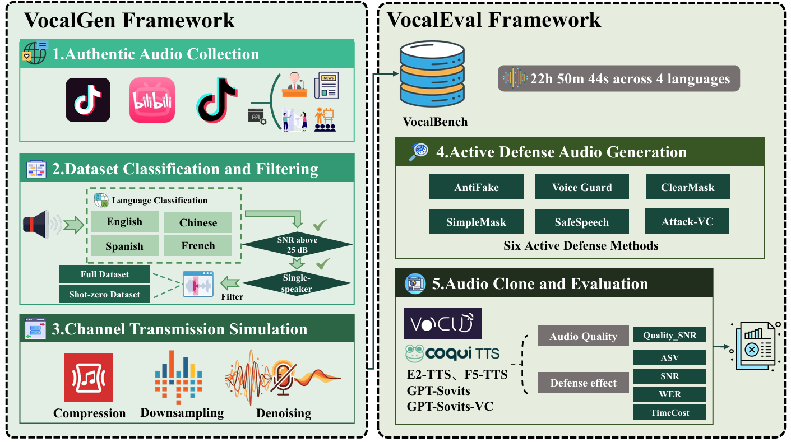

# VocalBench-The-First-Benchmark-for-Active-Defense

**Has Audio Deepfake Been Solved?**  
**VocalBench: The First Benchmark for Active Defense Methods Against Audio Deepfake**

[](https://github.com/VocalBench/VocalBench-The-First-Benchmark-for-Active-Defense)
[](#git-lfs)

VocalBench is a **systematic benchmark** for evaluating **active defense** methods against **audio deepfakes** (voice cloning via TTS/VC).  
It is built to answer three practical questions:

- **Defense Performance**: does a defense generalize across diverse open-source and commercial TTS/VC systems?
- **Defense Robustness**: does the protection survive real-world channel effects (compression / denoising / downsampling)?
- **Defense Efficiency**: is the defense fast enough for real-time scenarios?

---

## Overview

The research community has proposed many countermeasures for audio deepfakes, including watermarking, passive detection, and **active defense**.  
Active defense is considered a more fundamental solution because it aims to **proactively reduce the usability of stolen voice** for cloning. However, its real-world effectiveness remains unclear.

This project provides:
- **VocalGen**: automated benchmark generation framework
- **VocalBench**: benchmark dataset generated by VocalGen
- **VocalEval**: automated evaluation pipeline for reproducible comparisons

## Requirements

- Git + Git LFS
- Python 3.9+ (varies by subproject)
- A GPU environment may be required for some baselines/backends

---

## Repository Structure

### `TTS/VC/` (large, Git LFS)
A collection of TTS/VC baseline projects used as cloning backends in evaluation.  
This directory is large and uses Git LFS heavily.

### `ActiveDefense/`
Active defense methods included in the benchmark:
- `ActiveDefense/AntiFake/`
- `ActiveDefense/SafeSpeech/`
- `ActiveDefense/VoiceGuard/`
- `ActiveDefense/Attack-VC/`
- `ActiveDefense/ClearMask/` *(paper-based; no official code)*
- `ActiveDefense/SampleMask/` *(paper-based; no official code)*

---

## Benchmark Principles

VocalBench is guided by three principles:

- **Comprehensiveness**  
  Covers diverse datasets, cloning models (TTS/VC), and multi-dimensional metrics.

- **No overestimation**  
  Applies realistic channel effects (compression, denoising, downsampling) to emulate real-world transmission/platform constraints.

- **No underestimation**  
  Uses real-world audio collected from social platforms to reduce the risk of public dataset leakage into TTS/VC training.

---

## Framework: VocalGen / VocalBench / VocalEval

### Overall Architecture

Framework figure:



VocalBench contains three components:
- **VocalGen**: dataset generation pipeline  
- **VocalBench**: benchmark dataset generated by VocalGen  
- **VocalEval**: unified evaluation pipeline for defense → cloning → metrics

### VocalGen: Dataset Generation
VocalGen constructs the dataset through:
1. **Authentic audio collection** from social platforms
2. **Classification & filtering**
   - 4 languages: English / Chinese / Spanish / French
   - Full vs. Zero-shot (zero-shot uses ~7s clips)
   - Quality constraints: SNR > 25 dB & single-speaker
3. **Channel transmission simulation**
   - compression
   - downsampling
   - denoising

### VocalEval: Automated Evaluation
VocalEval automates:
- defense audio generation
- TTS/VC cloning
- multi-metric evaluation

Metrics used in the paper:
- **ASV**: speaker similarity (lower indicates stronger defense)
- **WER**: ASR word error rate (lower indicates stronger defense)
- **SNR**
- **TimeCost**: latency per sample
- **Quality_SNR**: `|SNR(pre) - SNR(post)|` (lower means less quality degradation)

---

## Evaluation Setup

### Active Defense Methods
The evaluation considers six representative methods:
- AntiFake
- SafeSpeech
- VoiceGuard
- Attack-VC
- ClearMask *(paper-based reimplementation due to no official code)*
- SampleMask *(paper-based reimplementation due to no official code)*

### Cloning Backends (TTS/VC)
VocalEval evaluates defenses against multiple cloning systems, including open-source and commercial services.

---

## Installation

### 1) Clone & download large files (Git LFS)

```powershell
git lfs install
git clone https://github.com/VocalBench/VocalBench-The-First-Benchmark-for-Active-Defense.git
cd VocalBench-The-First-Benchmark-for-Active-Defense
git lfs pull

# optional: verify LFS objects are present locally
git lfs ls-files
```

### 2) Python environment (recommended)

Many subprojects have their own dependencies. A practical approach is to create a Python environment, then install dependencies per subproject.

```powershell
python -m venv .venv
.\.venv\Scripts\activate
python -m pip install -U pip
```

---

## Quick Start (end-to-end workflow)

### 0) Suggested directory layout (inputs/outputs)

You can organize experiments with a consistent folder layout (names are suggestions):

```text
data/
  raw/                 # original (unprotected) audio
  protected/<method>/  # protected audio from each defense method
  cloned/<backend>/    # cloned outputs from each TTS/VC backend
results/
  metrics/             # evaluation outputs (ASV/WER/SNR/TimeCost/Quality_SNR)
```

Create folders (optional):

```powershell
mkdir data
mkdir data\raw
mkdir data\protected
mkdir data\cloned
mkdir results
mkdir results\metrics
```

### 1) Apply active defense (ActiveDefense)

Each active defense baseline is a vendored snapshot. Enter the method folder, install dependencies (if provided), and follow that method’s README.

Example (works as a template for all methods):

```powershell
cd ActiveDefense\AntiFake

# check method-specific instructions
if (Test-Path README.md) { type README.md }

# install dependencies if a requirements file exists
if (Test-Path requirements.txt) { python -m pip install -r requirements.txt }

# discover runnable entrypoints (scripts / configs)
dir

# quick scan for python entry files
Get-ChildItem -File -Filter "*.py" | Select-Object -First 30
```

Repeat the same pattern for:
- `ActiveDefense\AntiFake`
- `ActiveDefense\SafeSpeech`
- `ActiveDefense\VoiceGuard`
- `ActiveDefense\Attack-VC`
- `ActiveDefense\ClearMask`
- `ActiveDefense\SampleMask`

### 2) Clone with TTS/VC backends (TTS/VC)

TTS/VC backends are under `TTS/VC/`. Each backend is its own project and typically has its own setup and inference commands.

Template:

```powershell
cd TTS\VC
dir

# enter a backend folder, then follow its README
cd <BACKEND_NAME>
if (Test-Path README.md) { type README.md }
if (Test-Path requirements.txt) { python -m pip install -r requirements.txt }
dir

# quick scan for python entry files
Get-ChildItem -File -Filter "*.py" | Select-Object -First 30
```

### 3) Evaluate (VocalEval)

VocalEval compares protected/unprotected audio and cloned outputs using metrics such as:
- ASV
- WER
- SNR
- TimeCost
- Quality_SNR

Notes:
- This top-level README provides a unified workflow. The exact runnable commands live inside each subproject directory.
- If you want a fully automated one-click pipeline, it usually requires wiring the I/O paths across defense → cloning → evaluation.

---

## Troubleshooting

- **Git LFS files are placeholders**: run `git lfs pull` again and verify with `git lfs ls-files`.
- **Missing dependencies**: install per subproject (`requirements.txt` or method README).
- **CUDA / GPU issues**: some baselines require a matching CUDA + PyTorch setup.

---

## Git LFS

This repository uses **Git LFS** for large assets.

- Install Git LFS: https://git-lfs.com/
- Typical workflow:
  - `git lfs install`
  - `git clone https://github.com/VocalBench/VocalBench-The-First-Benchmark-for-Active-Defense`
  - `git lfs pull`

---

## Disclaimer
- The code under `TTS/VC/` and `ActiveDefense/` are **research snapshots** for reproducibility.
- Please comply with each subproject’s license and usage constraints.
